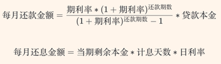

# 还款计划生成
## 还款方式
还款方式是指借款人偿还贷款本金和利息的方式，利息根据借款人剩余本金的多少计算得出。不同的还款方式决定本金归还速度的快慢，由此导致支付利息总额的不同。等额本息还款法本金逐月递增，利息逐月递减，月还款数不变；等额本金还款法本金保持相同，利息逐月递减，月还款数递减。二者相比，在贷款期限、金额和利率相同的情况下，在还款初期，等额本金还款方式每月归还的金额要大于等额本息。但按照整个还款期计算，等额本金还款方式会节省贷款利息的支出。 

总体来讲，等额本金还款方式适合有一定经济基础，能承担前期较大还款压力，且有提前还款计划的借款人。等额本息还款方式因每月归还相同的款项，方便安排收支，适合经济条件不允许前期还款投入过大，收入处于较稳定状态的借款人。

### 等额本息
贷款利率保持不变的前提条件下，每月还款金额均相等。各期的还款金额可拆分为本金和利息，但各期的本金和利息所占比例都在发生变化：本金所占份额逐渐上升，而利息所占份额逐期下降。

计算公式：


### 等额本金
贷款利率保持不变的前提条件下，每期还贷本金均等，每期还贷利息随着贷款本金的逐步减少而递减

计算公式：
```markdown
每月归还本金
    A=总本金/还款月数
每月归还利息
    B=(本金-累计已还本金)×计息天数×日利率
每月还款金额
    Sum=A+B
```
### 先息后本
分期付息：除最后一期之外的前几期，每期仅需归还当期利息。到期还本：贷款到期日（末期）全额还本及相应的利息

计算公式：
```markdown
每期归还利息
    A = (本金-累计已还本金)*该期的计息天数*日利率
到期日还款金额
   Sum=贷款本金+A
```
### 等本等息
在还款计划中，各期次应还款额相等，且各期次应还本金相等，各期次应还利息相等。

计算公式：
```markdown
贷款本金总额为All  期数为num
贷款总利息K：(N年+n天)
    K=All*年利率*年数N+All*(年利率/360)*计息天数n
    或
    K=All*(年利率/360)*总的贷款天数
各期应还本金A
    A=All/num
各期应还利息I 
    I=贷款总利息/num
各期应还款sum
    sum=A+I
```
### 利(息)随本清
在贷款的到期日，归还贷款全额本金及全部利息。无需分期归还贷款本息
计算公式：
```markdown
到期日归还利息
    A=本金*计息天数*日利率
到期日还款金额
    Sum=贷款本金+A
```

## 入参 出参描述
request body:
- LoanAmount    :贷款金额
- LoanStartDate :贷款开始日期
- LoanEndDate   :贷款结束日期
- LoanCycleCode :还款周期频率 :02-两周 03-月
- InterestRate  :年利率
- RepayMethod   :还款方式     :1-等额本息  2-等额本金  3-利随本清 4-先息后本 5-等本等息
- PeriodNum     :期数
- PeriodType    :期数类型     :01-年 02-月
- RepayDay      :每一期还款日  :1号至31号
- DaysOfYear    :年天数 默认360 

response body:
- RepayMethod       :还款方式     :1-等额本息  2-等额本金  3-利随本清 4-先息后本 5-等本等息
- LoanStartDate     :贷款开始日期
- LoanEndDate       :贷款结束日期
- TotalPeriodNum    :总期数
- TotalRepayAmount  :总还款金额
- LoanAmount        :贷款金额
- TotalInterest     :总还款利息
- InterestRate      :年利率
- PlanRepayRecords
    - PeriodNum              :期次
    - PeriodStartDate        :本期开始日期
    - PeriodEndDate          :本期结束日期
    - DaysOfPeriod           :本期天数
    - PeriodRepayDate        :本期还款日期
    - PeriodRepayTotalAmount :本期还款总金额
    - PeriodRepayPrinciple   :本期还款本金
    - PeriodRepayInterest    :本期还款利息
    - MaintainPrinciple      :剩余还款金额


